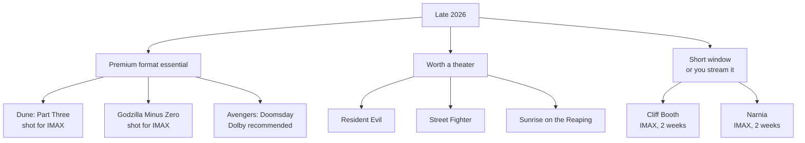

import Alert from '@/components/Alert.astro';

{/* ─────────────────────────────────────────────────────────────
    📌 MEDIA PLACEHOLDERS
    Trailer / image slots are marked throughout the body.
    - To embed a trailer, add this line under the Alert import above:
        import YouTubeEmbed from '@/components/YouTubeEmbed.astro';
      then replace the placeholder comment with:
        <YouTubeEmbed id="VIDEO_ID" title="Movie Title — Official Trailer" />
    - Stills and posters can be plain markdown images:
        
   ───────────────────────────────────────────────────────────── */}

> *Spider-Man: Brand New Day* and *The Odyssey* already burned through the summer — and the heavyweights are still ahead. Here is the complete September-through-December 2026 theatrical slate.

Back in the spring I put together a [2026 movie preview](/culture/2026-movie-lineup) (in Korean), and "the back half is where it gets real" was still an abstraction. It's four months away now. Some dates have moved, and several titles that weren't even on the calendar then have locked in. This post zooms in on **September to December only**, in more detail.

## What this post covers

- A month-by-month calendar of the fall/winter 2026 slate (North American dates)
- Directors, casts, and why each title matters
- The December 18 collision: *Dune: Part Three* vs. *Avengers: Doomsday*
- Premium format (IMAX / Dolby) recommendations and a viewing priority order

<Alert type="warning" title="About these dates">
  All dates below are **North American release dates**. International dates usually land in the same week but can shift, and streaming-hybrid titles may not get a wide theatrical run everywhere.
</Alert>

---

## 📅 The calendar at a glance

| Date (NA) | Title | Genre | In one line |
| :--- | :--- | :--- | :--- |
| Sep 2 | Fall 2: Deadpoint | Thriller | The vertigo survival sequel |
| Sep 4 | Onslaught | Sci-fi horror | A24's fall swing |
| Sep 18 | **Resident Evil** | Horror | Zach Cregger's reboot |
| Mid-Sep | Practical Magic 2 | Fantasy | Bullock × Kidman, 28 years later |
| Sep 25 | Avengers: Endgame — Encore | Re-release | Homework before Doomsday |
| Oct 2 | **Digger** | Black comedy | Iñárritu × Tom Cruise |
| Oct 2 | Verity | Thriller | Colleen Hoover adaptation |
| Oct 9 | **The Social Reckoning** | Drama | Sorkin returns to Facebook |
| Oct 9 | Other Mommy | Horror | Chastain in a dual role |
| Oct 16 | **Street Fighter** | Action | The live-action reboot |
| Oct 23 | Clayface | Body horror | The DCU's first R rating |
| Oct 23 | Klara and the Sun | Sci-fi drama | Ishiguro, directed by Waititi |
| Nov 6 | **Godzilla Minus Zero** | Kaiju | Direct sequel to Minus One |
| Nov 6 | Ramayana: Part 1 | Epic fantasy | India's biggest production ever |
| Nov 20 | **The Hunger Games: Sunrise on the Reaping** | Action | Young Haymitch |
| Nov 25 | The Further Mis-Adventures of Cliff Booth | Drama | Fincher directs Tarantino |
| Nov 26 | Narnia | Fantasy | Gerwig, IMAX-only window |
| Dec 4 | Violent Night 2 | Action comedy | Bloody Santa, round two |
| Dec 14 / 18 | **Dune: Part Three** | Sci-fi | Early IMAX, then wide |
| Dec 18 | **Avengers: Doomsday** | Action | The biggest MCU ensemble yet |
| Dec 23 | The Angry Birds Movie 3 | Animation | The family slot |
| Dec 25 | Jumanji: Open World | Action comedy | The franchise finale |
| Dec 25 | Werwulf | Horror | Robert Eggers' werewolf film |

---

## 🍂 September — a quiet month with a loud horror movie

The gap between summer tentpoles and the holiday slate is usually thin. This year one horror release could break that pattern.

### Resident Evil — Sep 18

{/* 📺 TRAILER SLOT — Resident Evil official trailer */}

**Director:** Zach Cregger / **Starring:** Austin Abrams, Paul Walter Hauser, Zach Cherry

*Barbarian* and *Weapons* made Zach Cregger the most interesting new name in horror, and Capcom's flagship IP is his next move. This is unconnected to both the Milla Jovovich run and the 2021 reboot.

The most interesting decision: it **doesn't adapt any existing game's story**. Instead it tells a new story inside the established universe — the approach Prime Video's *Fallout* proved out. The lead isn't Leon or Jill but Bryan (Austin Abrams), a medical courier making a delivery to Raccoon City General Hospital on the night the city collapses around him.

Abrams also starred in Cregger's *Weapons*. A director bringing his own people along suggests this is closer to "a Cregger horror film" than to fan service.

**🎬 Format pick:** Dolby Cinema — black-level detail and low end are what this genre lives on.

### Also in September

{/* 🖼️ IMAGE SLOT — September collage (optional) */}

- **Fall 2: Deadpoint** (Sep 2) — sequel to the micro-budget vertigo thriller.
- **Onslaught** (Sep 4) — A24 sci-fi action horror with Adria Arjona and Dan Stevens.
- **Practical Magic 2** (mid-Sep) — Sandra Bullock and Nicole Kidman return as the Owens sisters, 28 years on. Susanne Bier directs from an Akiva Goldsman script. *(Sources list both Sep 11 and Sep 18; will update once confirmed.)*
- **Avengers: Endgame — Encore** (Sep 25) — a re-release three months before *Doomsday*. Marvel wants you warmed up.

---

## 🎃 October — awards season meets Halloween

The most varied month of the back half, with Oscar plays and popcorn movies landing on the same weekends.

### Digger — Oct 2

{/* 📺 TRAILER SLOT — Digger official trailer */}

**Director:** Alejandro G. Iñárritu / **Starring:** Tom Cruise, Sandra Hüller, John Goodman, Jesse Plemons, Riz Ahmed

The least predictable pairing of the year. Iñárritu's first English-language film since *The Revenant*, and **Tom Cruise's first Iñárritu film**.

Warner Bros. is selling it as "a comedy of catastrophic proportions." Cruise plays Digger Rockwell, "the most powerful man in the world," racing to prove he is humanity's savior before the disaster he unleashed destroys everything. That is a direct inversion of the persona *Top Gun* and *Mission: Impossible* built.

It shot in the UK for six months and sits squarely in the fall festival corridor, which tells you what the studio is aiming at.

**🎬 Format pick:** standard is fine — a big screen helps Iñárritu's long takes, but format isn't the selling point here.

### The Social Reckoning — Oct 9

{/* 📺 TRAILER SLOT — The Social Reckoning official trailer */}

**Written and directed by:** Aaron Sorkin / **Starring:** Jeremy Strong, Mikey Madison, Jeremy Allen White, Bill Burr

Sorkin won an Oscar for writing *The Social Network* in 2010. This time he **directs as well**. It's positioned as a companion piece rather than a straight sequel.

The protagonist isn't Zuckerberg but whistleblower **Frances Haugen** (Mikey Madison), who teams with Wall Street Journal reporter Jeff Horwitz (Jeremy Allen White) to bring Facebook's internal research to light. Jeremy Strong plays an older Zuckerberg — an inevitable point of comparison with Jesse Eisenberg's version.

Madison off *Anora*, White off *The Bear*, and Sorkin dialogue. That's an awards-season fixture on paper.

### Street Fighter — Oct 16

{/* 📺 TRAILER SLOT — Street Fighter official trailer */}

**Director:** Kitao Sakurai / **Starring:** Andrew Koji (Ryu), Noah Centineo (Ken), Callina Liang (Chun-Li), Jason Momoa (Blanka)

Thirty-two years after the Jean-Claude Van Damme version, Capcom's fighting-game original goes live-action again — set in **1993**, when the game owned the arcade.

The cast list tells you the tone: Jason Momoa as Blanka, 50 Cent as Balrog, Roman Reigns as Akuma, Cody Rhodes as Guile. This is a party movie, not a serious martial arts drama. Andrew Koji, who proved himself on *Warrior*, plays Ryu.

**🎬 Format pick:** Dolby Cinema — half the appeal of the genre is impact sound.

### Also in October

- **Verity** (Oct 2) — Colleen Hoover adaptation with Anne Hathaway, Dakota Johnson, and Josh Hartnett.
- **Other Mommy** (Oct 9) — based on Josh Malerman's novel. Jessica Chastain plays both a working mother and the supernatural entity haunting her child. Produced by James Wan, directed by Rob Savage.
- **Clayface** (Oct 23) — the **DCU's first R-rated film**, and a body horror movie rather than a superhero one. Script by Mike Flanagan, directed by James Watkins. A roughly $40M swing, but a meaningful signal that James Gunn's DCU intends to work across genres. Moved from September 11 to the Halloween window.
- **Klara and the Sun** (Oct 23) — Kazuo Ishiguro adapted by Taika Waititi, with Jenna Ortega as the Artificial Friend and Amy Adams as the mother. The quietest title on the slate and possibly the most discussed.

---

## 🦖 November — franchises collide

November's firepower is concentrated in two windows: **Nov 6** and **Nov 20–26**.

### Godzilla Minus Zero — Nov 6 (Japan: Nov 3)

{/* 📺 TRAILER SLOT — Godzilla Minus Zero official trailer */}

**Director:** Takashi Yamazaki / **Starring:** Ryunosuke Kamiki, Minami Hamabe

A direct sequel to the VFX-Oscar-winning *Godzilla Minus One*, with the director and both leads returning.

The Japanese date of **November 3** isn't arbitrary — it's the day the original *Godzilla* opened in 1954. North America follows three days later via GKIDS, **the fastest a Japanese Godzilla film has ever reached the US**.

There's a technical first here too: this is the **first Japanese film shot specifically for IMAX**. Given that the previous entry embarrassed Hollywood tentpoles on a reported $15M budget, the question is what Yamazaki does with more room.

**🎬 Format pick:** **IMAX** — it was shot for it.

### The Hunger Games: Sunrise on the Reaping — Nov 20

{/* 📺 TRAILER SLOT — Sunrise on the Reaping official trailer */}

**Director:** Francis Lawrence / **Starring:** Joseph Zada, Ralph Fiennes, Glenn Close, Kieran Culkin, Elle Fanning, Mckenna Grace, Maya Hawke

Adapted from Suzanne Collins' 2025 novel. Set **24 years before** the original *Hunger Games*, it follows a young **Haymitch Abernathy** through the 50th Hunger Games — the Second Quarter Quell.

Readers know this is the cruelest arena in the series, with double the tributes and an ending that's already on the record. What's driving anticipation is the cast: Fiennes as President Snow, plus Close, Culkin, Fanning, Grace, and Hawke. That's a lot of prestige for a prequel.

Lionsgate is also bringing the earlier films back to theaters ahead of release.

### The Further Mis-Adventures of Cliff Booth — Nov 25 (IMAX)

{/* 📺 TRAILER SLOT — Cliff Booth official trailer */}

**Director:** David Fincher / **Written by:** Quentin Tarantino / **Starring:** Brad Pitt, Elizabeth Debicki, Yahya Abdul-Mateen II

Eight years after *Once Upon a Time in Hollywood*, we're back in **1977 Hollywood**, with Brad Pitt reprising the stuntman role that won him an Oscar.

The real story is the pairing: **Tarantino writes, Fincher shoots.** Those two sensibilities have never met head-on before.

The release model is worth noting too. It's a Netflix film, but it runs **exclusively in IMAX worldwide for two weeks from November 25** before hitting Netflix on December 23. This is Netflix's second IMAX partnership — the first being *Narnia*, immediately below.

<Alert type="tip" title="A two-week theatrical window">
  *Cliff Booth* (from Nov 25) and *Narnia* (from Nov 26) both run in IMAX for a limited window before moving to Netflix. If you want to see them on a big screen, "next weekend" may not exist.
</Alert>

### Also in November

- **Narnia** (Nov 26) — Greta Gerwig adapting *The Magician's Nephew*, with Meryl Streep, Daniel Craig, Carey Mulligan, and Emma Mackey. Roughly 1,000 IMAX screens across 90 countries over Thanksgiving, then Netflix on December 25.
- **Ramayana: Part 1** (Nov 6) — directed by Nitesh Tiwari, starring Ranbir Kapoor, Yash, and Sai Pallavi. Reportedly the most expensive Indian production ever, targeting **59,000 screens** worldwide. Both parts shot for IMAX; Part 2 is set for Diwali 2027.
- **Dr. Seuss' The Cat in the Hat** (Nov 6) — the family play.
- **Ebenezer: A Christmas Carol** (Nov 13) — a Dickens adaptation aimed at the holidays.

---

## 🎄 December — the actual final round

### Dune: Part Three — Dec 14 (early IMAX) / Dec 18 (wide)

{/* 📺 TRAILER SLOT — Dune: Part Three official trailer */}

**Director:** Denis Villeneuve / **Starring:** Timothée Chalamet, Zendaya, Florence Pugh, Robert Pattinson, Rebecca Ferguson, Anya Taylor-Joy, Javier Bardem

Villeneuve completes his Paul Atreides trilogy, adapting *Dune Messiah*. After a substantial time jump from *Part Two*, Emperor Paul faces the cost of the holy war he set in motion.

Format is the story here. Villeneuve has said the film was "dreamed, designed and shot" for IMAX, and it's the **first in the series shot with both IMAX-certified digital cameras and IMAX film cameras** — a break from the all-digital first two parts.

Hence the unusual rollout: **IMAX Insider screenings begin December 14**, four days before the wide release. Only 25 theaters in the US are running the IMAX 70mm presentation, so expect those to be difficult tickets.

**🎬 Format pick:** **IMAX, ideally a 1.43:1 GT screen** if one is within reach.

### Avengers: Doomsday — Dec 18

{/* 🖼️ IMAGE SLOT — Avengers: Doomsday poster/still */}
{/* 📺 TRAILER SLOT — Avengers: Doomsday official trailer */}

**Directors:** the Russo brothers / **Starring:** Robert Downey Jr. (Doctor Doom), Chris Hemsworth, Pedro Pascal, Patrick Stewart, Ian McKellen, Channing Tatum, and many more

Seven years after *Endgame*, the Russos are back — and the actor who was Iron Man returns as **the villain**.

July's first trailer featured Thor, Captain America (Sam Wilson), Shang-Chi, Yelena, the Thunderbolts, Namor, Black Panther, the Fantastic Four, Magneto, and Gambit. It's the largest ensemble in MCU history, with the Fox X-Men contingent — Patrick Stewart (Professor X), Alan Cumming (Nightcrawler), Rebecca Romijn (Mystique), James Marsden (Cyclops), Kelsey Grammer (Beast) — folded in.

**🎬 Format pick:** Dolby Cinema — IMAX screens will largely be spoken for by *Dune*.

### What actually happens on December 18

Two films, one date — but the real contest is **screen allocation**, not just box office.

| | Dune: Part Three | Avengers: Doomsday |
| :--- | :--- | :--- |
| Early screenings | Dec 14 IMAX Insider | None |
| Primary format | **IMAX** (incl. 70mm film) | **Dolby Cinema** |
| Advantage | Holds the IMAX screens | Showtime and screen volume |
| Ticket difficulty | IMAX will be brutal | Comparatively relaxed |

*Dune: Part Three* effectively locks up global IMAX for a stretch after release, so **seeing Doomsday in IMAX early on may not be an option.** Conversely, if you want *Dune* in IMAX, the December 14 on-sale date is the one to watch.

<Alert type="info" title="A practical December plan">
  1. **Dune: Part Three** → IMAX (GT if possible), early screening or opening weekend. 
  2. **Avengers: Doomsday** → Dolby Cinema, or wait for IMAX screens to reallocate in weeks 2–3. 
  3. If you want both in IMAX, pushing Doomsday to January is the low-stress path.
</Alert>

### Also in December

- **Jumanji: Open World** (Dec 25) — Dwayne Johnson, Jack Black, Kevin Hart, and Karen Gillan return for the **final** entry, in which the game's characters break out into the real world. Danny DeVito is back too.
- **Werwulf** (Dec 25) — Robert Eggers' follow-up to *Nosferatu*, set in 13th-century England. Aaron Taylor-Johnson, Lily-Rose Depp, Willem Dafoe, Ralph Ineson. Eggers has called it the darkest thing he's written. Releasing it on Christmas Day is a genuinely bold call by Focus Features.
- **Violent Night 2** (Dec 4) — David Harbour's violent Santa, round two.
- **The Angry Birds Movie 3** (Dec 23) — the safe family bet for the holidays.

---

## 🏆 Viewing priority

Sorting the slate by how much the presentation actually matters:

The real pressure point of the back half isn't December — it's **late November**. *Cliff Booth* and *Narnia* have hard two-week windows, so "I'll catch it next weekend" doesn't apply. The December titles will be around for a month or more.

And don't sleep on the *Endgame* re-release on September 25. There's no better way to prime yourself for December, and theatrical chances at that film don't come around often.

<Alert type="info">
  For the first half of 2026 — *Michael*, *The Mandalorian and Grogu*, *Toy Story 5*, *The Odyssey*, *Spider-Man: Brand New Day* — see the [2026 movie preview](/culture/2026-movie-lineup) (in Korean).
</Alert>
