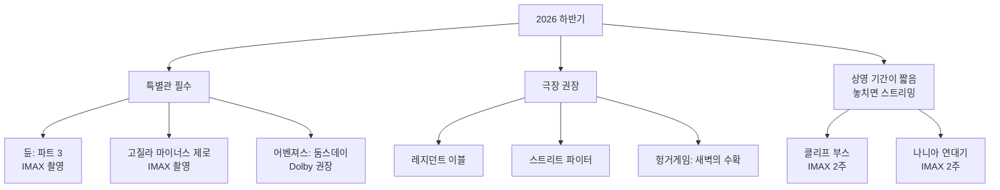

import Alert from '@/components/Alert.astro';

{/* ─────────────────────────────────────────────────────────────
    📌 미디어 삽입 안내
    본문 곳곳에 "예고편 자리 / 이미지 자리" 주석을 남겨두었습니다.
    - 예고편을 넣으려면 이 파일 상단(위 Alert import 아래)에 다음 줄을 추가하세요:
        import YouTubeEmbed from '@/components/YouTubeEmbed.astro';
      그리고 해당 위치의 주석을 아래 형태로 바꿔주세요:
        <YouTubeEmbed id="영상ID" title="영화 제목 공식 예고편" />
    - 스틸컷/포스터는 그냥 마크다운 이미지로 넣으면 됩니다:
        
   ───────────────────────────────────────────────────────────── */}

> 《스파이더맨: 브랜드 뉴 데이》와 《오디세이》로 여름을 태웠는데, 정작 진짜 물건들은 아직 남아 있습니다. 9월부터 12월까지, 2026년 하반기 극장 라인업을 한 번에 정리했습니다.

지난봄에 [2026년 해외 영화 기대작 총정리](/culture/2026-movie-lineup)를 쓸 때만 해도 "연말이 진짜다"라는 말이 막연했는데, 이제 넉 달 앞으로 다가왔습니다. 그사이 개봉일이 밀리거나 당겨진 작품도 있고, 그때는 언급조차 없던 작품이 하반기 라인업으로 확정되기도 했어요. 이 글은 **9~12월 구간만 다시, 더 촘촘하게** 훑는 글입니다.

## 이 글에서 다루는 내용

- 2026년 9~12월 개봉 예정작 월별 캘린더 (북미 기준)
- 작품별 감독·주연·화제성 포인트
- 12월 18일 《듄: 파트 3》 vs 《어벤져스: 둠스데이》 정면충돌 분석
- 특별관(IMAX / Dolby) 추천과 관람 우선순위

<Alert type="warning" title="개봉일 안내">
  아래 날짜는 모두 **북미 개봉일** 기준입니다. 한국 개봉일은 대체로 같은 주(수요일 개봉 관행상 1~2일 빠른 경우도 많음)에 잡히지만, 확정 발표 전까지는 변동될 수 있어요. 특히 비(非)할리우드 작품이나 스트리밍 병행작은 국내 극장 개봉 자체가 확정되지 않은 경우도 있습니다.
</Alert>

---

## 📅 한눈에 보는 하반기 캘린더

| 개봉일(북미) | 제목 | 장르 | 한 줄 요약 |
| :--- | :--- | :--- | :--- |
| 09. 02 | 폴 2: 데드포인트 | 스릴러 | 고소공포 생존극 속편 |
| 09. 04 | 온슬로트 | SF 호러 | A24의 가을 한 방 |
| 09. 18 | **레지던트 이블** | 호러 | 《웨폰스》 잭 크레거의 리부트 |
| 09. 중순 | 프랙티컬 매직 2 | 판타지 | 불럭 × 키드먼 28년 만의 재회 |
| 09. 25 | 어벤져스: 엔드게임 앙코르 | 재개봉 | 둠스데이 전 복습용 |
| 10. 02 | **디거** | 블랙코미디 | 이냐리투 × 톰 크루즈 |
| 10. 02 | 베리티 | 스릴러 | 콜린 후버 원작, 해서웨이 |
| 10. 09 | **소셜 레코닝** | 드라마 | 《소셜 네트워크》 후속 |
| 10. 09 | 아더 마미 | 호러 | 제시카 차스테인 1인 2역 |
| 10. 16 | **스트리트 파이터** | 액션 | 실사 리부트, 모모아 합류 |
| 10. 23 | 클레이페이스 | 바디 호러 | DCU 첫 R등급 |
| 10. 23 | 클라라와 태양 | SF 드라마 | 이시구로 원작, 와이티티 연출 |
| 11. 06 | **고질라 마이너스 제로** | 괴수 | 《마이너스 원》 직속 후속 |
| 11. 06 | 라마야나 파트 1 | 서사 판타지 | 인도 영화 사상 최대 규모 |
| 11. 20 | **헝거게임: 새벽의 수확** | 액션 | 젊은 헤이미치의 이야기 |
| 11. 25 | 클리프 부스 | 드라마 | 핀처 연출 × 타란티노 각본 |
| 11. 26 | 나니아 연대기 | 판타지 | 그레타 거윅 × IMAX 한정 |
| 12. 04 | 바이올런트 나이트 2 | 액션 코미디 | 피 튀기는 산타 시즌 2 |
| 12. 14 / 18 | **듄: 파트 3** | SF | IMAX 선행 상영 후 정식 개봉 |
| 12. 18 | **어벤져스: 둠스데이** | 액션 | MCU 최대 규모 앙상블 |
| 12. 23 | 앵그리버드 3 | 애니메이션 | 연말 가족 관객용 |
| 12. 25 | 주만지: 오픈 월드 | 액션 코미디 | 프랜차이즈 최종장 |
| 12. 25 | 웨어울프 | 호러 | 로버트 에거스의 늑대인간 |

---

## 🍂 9월 — 워밍업, 그런데 호러가 세다

여름 텐트폴과 연말 대작 사이의 비수기지만, 올해 9월은 호러 한 편이 판을 흔들 가능성이 있습니다.

### 레지던트 이블 — 09. 18

{/* 📺 예고편 자리 — 레지던트 이블 공식 예고편 */}

**감독:** 잭 크레거 / **주연:** 오스틴 에이브럼스, 폴 월터 하우저, 잭 체리

《바바리안》과 《웨폰스》로 "호러계의 새 얼굴"이 된 잭 크레거가 캡콤의 대표 IP를 손에 쥐었습니다. 밀라 요보비치 시리즈와도, 2021년 리부트와도 무관한 완전한 새 출발이에요.

가장 흥미로운 선택은 **기존 게임의 스토리를 그대로 옮기지 않는다**는 점입니다. 게임 세계관 안에서 새로운 이야기를 만드는 방식 — 프라임비디오 《폴아웃》이 성공시킨 그 접근법이죠. 주인공은 레온이나 질이 아니라, 라쿤시티 종합병원으로 배송을 가던 의료 택배기사 브라이언(오스틴 에이브럼스)입니다. 하룻밤 사이 도시가 무너지는 동안 그저 살아남으려 뛰는 이야기.

에이브럼스는 크레거의 전작 《웨폰스》에도 출연했던 배우입니다. 감독이 자기 사람을 데려왔다는 건, 이 영화가 "게임 팬 서비스"보다 "크레거표 호러"에 가깝다는 신호로 읽혀요.

**🎬 특별관 추천:** Dolby Cinema — 어두운 화면의 계조와 저음이 승부처인 호러입니다.

### 그 외 9월

{/* 🖼️ 이미지 자리 — 9월 개봉작 콜라주 (선택) */}

- **폴 2: 데드포인트** (09. 02) — 저예산으로 대박을 낸 고소공포 스릴러 《폴》의 속편.
- **온슬로트** (09. 04) — A24가 내놓는 SF 액션 호러. 아드리아 아르호나, 댄 스티븐스 출연.
- **프랙티컬 매직 2** (09월 중순) — 산드라 불럭과 니콜 키드먼이 1998년작 이후 오웬스 자매로 돌아옵니다. 수산네 비에르 연출, 아키바 골즈먼 각본. *(개봉일이 9월 11일과 18일로 소스마다 엇갈립니다. 확정 시 수정 예정)*
- **어벤져스: 엔드게임 앙코르** (09. 25) — 《둠스데이》 개봉 3개월 전 재개봉. 극장에서 복습하고 12월을 맞이하라는 마블의 노림수입니다.

---

## 🎃 10월 — 시상식 시즌과 할로윈이 겹치는 달

하반기에서 라인업이 가장 다채로운 달입니다. 오스카 노림수 작품과 팝콘 무비가 같은 주에 붙어요.

### 디거 (Digger) — 10. 02

{/* 📺 예고편 자리 — 디거 공식 예고편 */}

**감독:** 알레한드로 G. 이냐리투 / **주연:** 톰 크루즈, 산드라 휠러, 존 굿맨, 제시 플레먼스, 리즈 아메드

올해 가장 예측 불가능한 조합입니다. 《버드맨》, 《레버넌트》로 아카데미 감독상을 연속 수상한 이냐리투가 《레버넌트》 이후 처음 내놓는 영어권 영화이자, **톰 크루즈의 첫 이냐리투 영화**예요.

워너브라더스가 붙인 로그라인은 "재앙적 규모의 코미디". 크루즈가 맡은 디거 록웰은 "세상에서 가장 강력한 남자"로, 자신이 촉발한 재앙이 모든 걸 파괴하기 전에 스스로가 인류의 구원자임을 증명하려 광분하는 인물입니다. 《탑건》과 《미션 임파서블》로 굳어진 크루즈의 이미지를 정면으로 비트는 배역이죠.

영국에서 6개월간 촬영했고, 가을 영화제 구간에 배치된 걸 보면 스튜디오가 시상식을 노리고 있다는 뜻입니다.

**🎬 특별관 추천:** 일반관도 충분 — 이냐리투 특유의 롱테이크를 큰 화면에서 보면 좋지만, 포맷 자체가 셀링포인트인 영화는 아닙니다.

### 소셜 레코닝 (The Social Reckoning) — 10. 09

{/* 📺 예고편 자리 — 소셜 레코닝 공식 예고편 */}

**감독/각본:** 애런 소킨 / **주연:** 제레미 스트롱, 마이키 매디슨, 제레미 앨런 화이트, 빌 버

2010년 《소셜 네트워크》의 각본으로 아카데미를 받은 애런 소킨이, 이번엔 **직접 연출까지** 맡아 돌아옵니다. 정확히는 속편이라기보다 '동반작(companion piece)'.

주인공은 저커버그가 아니라 내부고발자 **프랜시스 하우건**(마이키 매디슨)입니다. 월스트리트저널 기자 제프 호위츠(제레미 앨런 화이트)와 손잡고 페이스북의 내부 문서를 세상에 꺼내는 이야기죠. 제레미 스트롱이 나이 든 저커버그를 연기합니다 — 제시 아이젠버그가 연기한 20대 저커버그와 비교하는 재미가 있을 거예요.

《아노라》의 마이키 매디슨, 《베어》의 제레미 앨런 화이트, 여기에 소킨 특유의 속사포 대사. 조합만으로도 시상식 시즌의 단골손님이 될 만합니다.

### 스트리트 파이터 — 10. 16

{/* 📺 예고편 자리 — 스트리트 파이터 공식 예고편 */}

**감독:** 키타오 사쿠라이 / **주연:** 앤드류 코지(류), 노아 센티네오(켄), 칼리나 량(춘리), 제이슨 모모아(블랑카)

1994년 장 클로드 반담 버전 이후 32년, 캡콤의 대전격투 원조가 다시 실사화됩니다. 배경은 **1993년** — 게임이 오락실을 지배하던 바로 그 시절로 시간을 되돌렸어요.

캐스팅 리스트를 보면 이 영화의 톤이 짐작됩니다. 제이슨 모모아가 블랑카, 50센트가 발로그, WWE의 로만 레인즈가 아쿠마, 코디 로즈가 가일. 진지한 무협물보다는 축제형 팝콘 무비에 가깝겠죠. 류 역의 앤드류 코지는 《워리어》로 액션 실력을 검증받은 배우입니다.

**🎬 특별관 추천:** Dolby Cinema — 타격음이 반은 먹고 들어가는 장르입니다.

### 그 외 10월

- **베리티** (10. 02) — 콜린 후버 베스트셀러 원작 스릴러. 앤 해서웨이, 다코타 존슨, 조시 하트넷.
- **아더 마미** (10. 09) — 조시 맬러먼(《버드 박스》 작가) 원작. 제시카 차스테인이 워킹맘 우르술라와 초자연적 존재 '아더 마미' 1인 2역. 제임스 완 제작, 롭 새비지 연출.
- **클레이페이스** (10. 23) — DCU **첫 R등급** 작품이자 바디 호러. 마이크 플래너건 각본, 제임스 왓킨스 연출. 제작비 4천만 달러대의 소품이지만, 제임스 건의 DCU가 장르 다변화를 시도한다는 점에서 의미가 큽니다. 원래 9월 11일이었다가 할로윈 시즌으로 옮겼어요.
- **클라라와 태양** (10. 23) — 가즈오 이시구로 원작을 타이카 와이티티가 연출. 제나 오르테가가 인공 친구 '클라라'를, 에이미 애덤스가 엄마 역을 맡았습니다. 하반기 라인업 중 가장 조용하지만 가장 많이 회자될 가능성이 있는 작품.

---

## 🦖 11월 — 프랜차이즈들의 격돌

11월은 **11월 6일**과 **11월 20~26일** 두 구간에 화력이 몰려 있습니다.

### 고질라 마이너스 제로 — 11. 06 (일본 11. 03)

{/* 📺 예고편 자리 — 고질라 마이너스 제로 공식 예고편 */}

**감독:** 야마자키 다카시 / **주연:** 카미키 류노스케, 하마베 미나미

아카데미 시각효과상을 받은 《고질라 마이너스 원》의 직속 후속편입니다. 감독·주연이 그대로 돌아왔어요.

일본 개봉일 **11월 3일**은 그냥 고른 날이 아닙니다. 1954년 초대 《고지라》가 개봉한 바로 그 날짜죠. 북미는 사흘 뒤인 11월 6일 GKIDS 배급으로 개봉하는데, **일본 고질라 영화가 미국에 이렇게 빨리 도착한 건 역사상 처음**입니다.

기술적으로도 화제입니다. 이 작품은 **IMAX 촬영을 전제로 만들어진 최초의 일본 영화**예요. 전작이 1,500만 달러라는 믿기 힘든 예산으로 할리우드 대작들을 부끄럽게 만들었던 걸 생각하면, 이번엔 규모가 커진 상태에서 어떤 결과물이 나올지가 관전 포인트입니다.

**🎬 특별관 추천:** **IMAX** — IMAX를 상정하고 찍은 영화입니다.

### 헝거게임: 새벽의 수확 — 11. 20

{/* 📺 예고편 자리 — 헝거게임: 새벽의 수확 공식 예고편 */}

**감독:** 프랜시스 로렌스 / **주연:** 조셉 지어, 랄프 파인즈, 글렌 클로즈, 키에란 컬킨, 엘르 패닝, 매켄나 그레이스, 마야 호크

수잰 콜린스의 2025년 신작 소설이 원작. 1편 《헝거게임》으로부터 **24년 전**, 제50회 헝거게임(제2회 쿼터 퀠)에 끌려간 **젊은 헤이미치 애버내시**의 이야기입니다.

원작 팬이라면 알겠지만, 이건 시리즈에서 가장 잔인한 회차예요. 조공인이 두 배로 늘어난 쿼터 퀠이고, 결말도 이미 알려져 있습니다. 그럼에도 기대를 모으는 건 캐스팅 때문이죠. 랄프 파인즈(스노우 대통령), 글렌 클로즈, 키에란 컬킨, 엘르 패닝, 매켄나 그레이스, 마야 호크까지 — 프리퀄이라기엔 과할 정도의 라인업입니다.

라이온스게이트는 개봉 전 기존 시리즈 극장 재상영도 준비 중입니다.

### 클리프 부스의 더 기막힌 모험 — 11. 25 (IMAX)

{/* 📺 예고편 자리 — 클리프 부스 공식 예고편 */}

**감독:** 데이비드 핀처 / **각본:** 쿠엔틴 타란티노 / **주연:** 브래드 피트, 엘리자베스 데비키, 야히아 압둘 마틴 2세

《원스 어폰 어 타임... 인 할리우드》의 8년 뒤, **1977년의 할리우드**로 돌아갑니다. 브래드 피트가 아카데미 남우조연상을 안겨준 스턴트맨 클리프 부스를 다시 연기해요.

이 프로젝트의 진짜 화제는 조합입니다. **타란티노가 쓰고 핀처가 찍는다.** 두 사람의 스타일이 이렇게 정면으로 만나는 건 처음이죠.

배급 방식도 눈여겨볼 만합니다. 넷플릭스 작품이지만 **11월 25일부터 2주간 전 세계 IMAX 독점 상영** 후, 12월 23일 넷플릭스 공개. 넷플릭스가 IMAX와 손잡는 두 번째 사례입니다(첫 번째는 바로 다음에 나올 《나니아》).

<Alert type="tip" title="극장에서 볼 기회는 2주뿐">
  《클리프 부스》(11/25~)와 《나니아》(11/26~)는 모두 IMAX 한정 상영 후 넷플릭스로 넘어갑니다. 극장에서 볼 생각이라면 상영 기간이 짧다는 점을 염두에 두세요. 국내 상영관 규모도 아직 미확정입니다.
</Alert>

### 그 외 11월

- **나니아 연대기** (11. 26) — 그레타 거윅 연출, 《마법사의 조카》 원작. 메릴 스트립, 대니얼 크레이그, 케리 멀리건, 에마 매키. 전 세계 90개국 약 1,000개 IMAX 스크린에서 추수감사절 개봉 후 12월 25일 넷플릭스 공개.
- **라마야나 파트 1** (11. 06) — 니테시 티와리 연출, 란비르 카푸르·야쉬·사이 팔라비 주연. 인도 영화 사상 최대 제작비로 알려졌고, 전 세계 **59,000개 스크린**을 노립니다. 두 파트 모두 IMAX 촬영. 파트 2는 2027년 디왈리 예정.
- **닥터 수스: 캣 인 더 햇** (11. 06) — 워너 애니메이션의 가족 관객용 카드.
- **에비니저: 크리스마스 캐럴** (11. 13) — 연말 시즌을 겨냥한 디킨스 각색.

---

## 🎄 12월 — 진짜 결승전

### 듄: 파트 3 — 12. 14 (IMAX 선행) / 12. 18 (정식)

{/* 📺 예고편 자리 — 듄: 파트 3 공식 예고편 */}

**감독:** 드니 빌뇌브 / **주연:** 티모테 샬라메, 젠데이아, 플로렌스 퓨, 로버트 패틴슨, 레베카 퍼거슨, 안야 테일러조이, 하비에르 바르뎀

빌뇌브의 폴 아트레이드 3부작이 완결됩니다. 원작은 《듄 메시아》. 파트 2 이후 시간이 크게 흐른 뒤, 황제가 된 폴이 자신이 시작한 성전의 대가와 마주하는 이야기입니다.

포맷이 이 영화의 핵심입니다. 빌뇌브는 이 작품이 "IMAX를 위해 꿈꾸고, 설계하고, 촬영됐다"고 말했고, 실제로 **IMAX 인증 디지털 카메라와 IMAX 필름 카메라를 함께 사용한 시리즈 첫 작품**입니다. 파트 1·2가 전부 디지털이었던 것과 대비되죠.

그래서 배급 전략도 특이합니다. 정식 개봉(12/18) 나흘 전인 **12월 14일부터 IMAX 인사이더 상영**이 먼저 열립니다. 북미 기준 IMAX 70mm 필름 상영은 전국 25개 관뿐이라 예매 전쟁이 예상돼요.

**🎬 특별관 추천:** **IMAX, 그중에서도 GT 상영관** — 국내에 1.43:1 화면비 IMAX GT관이 있다면 무조건 그쪽입니다.

### 어벤져스: 둠스데이 — 12. 18

{/* 🖼️ 이미지 자리 — 어벤져스: 둠스데이 포스터/스틸 */}
{/* 📺 예고편 자리 — 어벤져스: 둠스데이 공식 예고편 */}

**감독:** 루소 형제 / **주연:** 로버트 다우니 주니어(닥터 둠), 크리스 헴스워스, 페드로 파스칼, 패트릭 스튜어트, 이안 맥켈런, 채닝 테이텀 외

《엔드게임》 이후 7년, 루소 형제가 MCU로 복귀합니다. 그리고 아이언맨이었던 RDJ가 이번엔 **빌런 닥터 둠**으로 돌아오죠.

7월 공개된 첫 예고편에는 토르, 캡틴 아메리카(샘 윌슨), 샹치, 옐레나, 썬더볼츠, 네이머, 블랙 팬서, 판타스틱 포, 매그니토, 감빗까지 등장했습니다. MCU 역사상 최대 규모의 앙상블이에요. 패트릭 스튜어트(프로페서 X), 알란 커밍(나이트크롤러), 레베카 로미즌(미스틱), 제임스 마스던(사이클롭스), 켈시 그래머(비스트) 등 폭스 엑스맨 배우들이 대거 합류합니다.

**🎬 특별관 추천:** Dolby Cinema — IMAX 스크린이 《듄: 파트 3》에 집중될 가능성이 크기 때문에, 현실적인 대안입니다.

### 12월 18일, 무슨 일이 벌어지나

같은 날 두 편이 붙습니다. 그런데 단순한 흥행 경쟁이 아니라 **스크린 확보 싸움**이라는 게 포인트예요.

| | 듄: 파트 3 | 어벤져스: 둠스데이 |
| :--- | :--- | :--- |
| 선행 상영 | 12/14 IMAX 인사이더 | 없음 |
| 주력 포맷 | **IMAX** (70mm 필름 포함) | **Dolby Cinema** |
| 강점 | IMAX 스크린 선점 | 상영 회차·스크린 물량 |
| 예매 난이도 | IMAX는 매우 치열할 전망 | 비교적 여유 |

《듄: 파트 3》가 개봉 후 일정 기간 글로벌 IMAX 상영관을 사실상 선점하는 구조라, **둠스데이를 IMAX로 보려는 계획은 초반에 어려울 수 있습니다.** 반대로 듄을 IMAX로 보려면 12월 14일 선행 상영 예매가 열리는 시점을 놓치지 말아야 하고요.

<Alert type="info" title="현실적인 12월 관람 플랜">
  1. **듄: 파트 3** → IMAX(가능하면 GT관) 선행 상영 또는 개봉 첫 주. 
  2. **어벤져스: 둠스데이** → Dolby Cinema 또는 개봉 2~3주 차 IMAX 재배정 시기를 노리기. 
  3. 두 편 다 IMAX로 보고 싶다면, 둠스데이를 1월로 미루는 게 오히려 편할 수 있습니다.
</Alert>

### 그 외 12월

- **주만지: 오픈 월드** (12. 25) — 드웨인 존슨, 잭 블랙, 케빈 하트, 카렌 길런 복귀. 프랜차이즈 **최종장**이며, 이번엔 게임 속 캐릭터들이 현실 세계로 튀어나옵니다. 대니 드비토도 돌아와요.
- **웨어울프** (12. 25) — 로버트 에거스가 《노스페라투》 다음으로 내놓는 13세기 잉글랜드 배경 늑대인간 영화. 애런 테일러 존슨, 릴리 로즈 뎁, 윌렘 대포, 랄프 아이네슨. 감독 본인이 "지금까지 쓴 것 중 가장 어두운 이야기"라고 표현했습니다. 크리스마스에 이걸 트는 포커스 피처스의 배짱이 대단하네요.
- **바이올런트 나이트 2** (12. 04) — 데이비드 하버의 폭력 산타 시즌 2.
- **앵그리버드 3** (12. 23) — 연말 가족 관객 시장의 안전한 카드.

---

## 🏆 정리: 하반기 관람 우선순위

극장에서, 그것도 특별관에서 봐야 값어치가 나오는 작품과 그렇지 않은 작품을 나눠보면 이렇습니다.

개인적으로 하반기의 진짜 승부처는 12월이 아니라 **11월 말**이라고 봅니다. 《클리프 부스》와 《나니아》는 상영 기간이 2주로 못 박혀 있어서, 12월 대작들처럼 "다음 주에 보지 뭐"가 안 통하거든요. 12월 두 편은 어차피 몇 주씩 걸리니까요.

그리고 9월 25일 《엔드게임》 재개봉 — 12월을 위한 예열로 이만한 게 없습니다. 극장에서 다시 볼 기회가 또 언제 오겠어요.

<Alert type="info">
  상반기 라인업(마이클, 만달로리안과 그로구, 토이스토리 5, 오디세이, 스파이더맨: 브랜드 뉴 데이 등)이 궁금하다면 [2026년 해외 영화 기대작 총정리](/culture/2026-movie-lineup)를 참고하세요.
</Alert>
