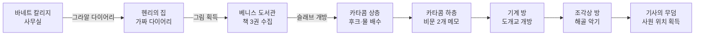

import Alert from '@/components/Alert.astro';
import YouTubeEmbed from '@/components/YouTubeEmbed.astro';

> 채찍과 그라알 다이어리만 들고, 인디아나 존스는 아버지를 찾아 떠난다. 그 여정의 시작은 언제나 그렇듯 — 학교 복도다.

## 이 글에서 다루는 내용

- 바네트 칼리지 — 그라알 다이어리 입수와 출발 준비
- 헨리 존스의 집 — 숨겨진 가짜 다이어리와 소형 열쇠
- 베니스 도서관 — 세 권의 책과 카타콤 입구
- 베니스 카타콤 — 두 개의 비문, 기계 장치, 기사의 무덤
- 각 구간의 막히는 포인트를 3단계 힌트로 정리

<Alert type="warning" title="스포일러 주의">
이 글은 공략 포스트입니다. 퍼즐 풀이와 스토리 전개를 모두 다룹니다.
</Alert>

<Alert type="danger" title="Dead-end 주의">
*Last Crusade*는 LucasArts 어드벤처 게임 중 막다른 길이 존재하는 마지막 작품이다. 특히 베니스 도서관 구간에서 **그라알 다이어리를 반드시 열어 비문 내용을 메모**해야 한다. 이 정보 없이 카타콤을 클리어해도 나중에 이를 확인할 방법이 없어져 최종 관문을 통과할 수 없다.
</Alert>

---

## 바네트 칼리지 — 모든 것이 시작되는 곳

게임은 바네트 칼리지 복도에서 시작된다. 영화와 달리 게임에서 인디는 권투 시합을 막 끝낸 참이다 — 각본에는 있었지만 최종 영화에서 잘려나간 장면이다.

곧 사업가 월터 도노반(Donovan)이 나타나 인디에게 성배 탐사 의뢰를 한다. 그의 아버지 헨리 존스 시니어가 행방불명됐다는 것도 함께. 대화를 마치면 인디는 다시 캠퍼스로 돌아온다. 이제 본격적인 탐색이 시작된다.

### 인디의 사무실

캠퍼스에서 사무실로 들어간다. 여기서 챙겨야 할 것은 하나뿐이다.

💡 사무실에서 뭘 해야 하지?

책상 위 패키지(package)가 목표다. 바로 집을 순서가 있다.

🗺️ 조금 더 알려줘

책상 위 편지들 아래에 **패키지**가 있다. 집어들어 **열면(Open)** 그라알 다이어리가 나온다. 이게 게임 전체를 통틀어 가장 중요한 아이템이다.

그 다음엔 선반 중간의 **유리병(jar of solvent)** 도 집어야 한다. 아직은 쓸 데가 없지만, 잠시 후 헨리의 집에서 반드시 필요하다.

🔍 전체 정답

1. 책상 위 **Letters**를 들어 아래의 **Package** 꺼내기
2. Package를 **Open** → **Grail Diary** 획득
3. 선반 중간의 **Jar of Solvent** 획득
4. 사무실에서 나와 헨리의 집으로 Travel

---

### 헨리의 집 — 숨겨진 가짜 다이어리

아버지의 집에 도착하면 거실에 책장과 테이블이 있다. 이 방 안에 중요한 아이템 두 가지가 숨어 있다.

이 구간은 처음 플레이할 때 많은 이들이 막히는 포인트다. 책장을 잡아당긴다는 발상이 직관적이지 않기 때문이다.

💡 방 안에 뭔가 숨겨진 것 같은데?

책장과 테이블 위 화분, 테이블보 — 이 세 가지를 모두 주목하자. 순서가 있다.

🗺️ 조금 더 알려줘

**책장을 잡아당기면(Pull)** 뒤쪽에 끈적한 테이프(Sticky Tape)가 붙어 있다. 이걸 **당겨서(Pull)** 떼어낸다.

테이프를 인디 사무실의 용제 병(Jar of Solvent)과 사용하면 **소형 열쇠(Small Key)** 가 나온다 — 테이프 안에 끼어 있던 것이다.

화분 아래 테이블보를 걷으면 **잠긴 상자**가 드러난다. 소형 열쇠로 열면 **낡은 책(Old Book)**, 즉 가짜 그라알 다이어리가 나온다.

🔍 전체 정답

1. 책장 **Pull** → 뒤에 붙은 **Sticky Tape Pull**
2. 사무실로 돌아가 Sticky Tape를 **Jar of Solvent**에 Use → **Small Key** 획득
3. 헨리 집으로 돌아와 화분 집어 테이블 위에 내려놓기
4. **Table Cloth** 들어내기 → 잠긴 상자 노출
5. Small Key로 상자 열기 → **Old Book(가짜 다이어리)** 획득
6. 침실로 들어가 벽에 걸린 **Painting(그림)** 집기

<Alert type="info" title="침실의 그림">
헨리의 침실 벽에 걸린 그림도 반드시 챙겨야 한다. 브룬발트 성에서 결정적으로 사용된다. 놓치기 쉬운 아이템 중 하나.
</Alert>

---

## 베니스 — 엘사와의 만남

준비를 마치면 드디어 베니스로 이동할 수 있다. 인디와 마커스 브로디가 베니스 테라스에 도착하면, 그곳에서 고고학자 엘사 슈나이더 박사가 기다리고 있다. 영화에서와 마찬가지로 인디와 엘사는 바로 도서관으로 향한다.

이 순간부터 인디의 트레이드마크인 **채찍(Whip)** 이 인벤토리에 추가된다.

### 베니스 도서관 — 세 권의 책

도서관은 원래 교회 건물이었다. 사서가 책상에 앉아 계속 도장을 찍고 있는데, 그 사서를 무시하고 서가를 탐색하면 된다.

여기서 챙겨야 할 것은 세 권의 책과 두 가지 소품이다. 그리고 이 구간에는 **게임 전체를 망칠 수 있는 함정 하나**가 숨어 있다.

💡 도서관에서 뭘 해야 하지?

서가를 왼쪽부터 쭉 탐색하자. "Maps of Ancient Italy", "Complete Works of Famous Dictators", "How To..." 라벨이 붙은 책 묶음이 각각 중요하다.

🗺️ 조금 더 알려줘

- **"Maps of Ancient Italy"** → **Book of Maps** 획득 (카타콤 지도)
- **"Complete Works of Famous Dictators"** → **Mein Kampf** 획득 (나중에 베를린에서 사용)
- **"How To..."** → **Manual** 획득 (복엽기 조종 매뉴얼)

로마 숫자가 새겨진 바닥 슬래브가 있는 방에서는 **빨간 코돈(Red Cordon)** 과 **금속 기둥(Metal Post)** 을 챙긴다.

그리고 **반드시 Grail Diary를 열어(Open)** 내용을 확인해야 한다. 스테인드글라스 창문 그림과 그 아래 비문 내용이 적혀 있다. 이 내용이 무엇인지 **메모**해두자. 플레이어마다 내용이 달라지는 랜덤 요소다.

🔍 전체 정답 + Dead-end 회피

1. 왼쪽부터 서가 탐색: **Book of Maps**, **Mein Kampf**, **Manual** 획득
2. 로마 숫자 방에서 **Red Cordon**, **Metal Post** 획득
3. **Grail Diary Open** → 스테인드글라스 페이지의 비문 텍스트를 반드시 메모
4. 다이어리의 비문이 가리키는 로마 숫자 슬래브 확인 (예: "MDCCCXIII의 두 번째 숫자")
5. 해당 슬래브에 **Metal Post Use** → 카타콤 입구 개방

⚠️ **Dead-end 경고:** Metal Post를 잘못된 슬래브에 사용하면 좁은 방에 갇혀 위로 나갈 수밖에 없고, 그렇게 되면 도서관 밖으로 쫓겨나 카타콤에 영영 입장 불가 상태가 된다. **반드시 저장하고 진행**할 것.

---

## 베니스 카타콤 — 지하의 미로

카타콤은 이 게임에서 가장 복잡하고 헤매기 쉬운 구간이다. 지도를 보면서 체계적으로 탐색하는 것이 핵심이다. Book of Maps를 열면 상층과 하층 두 장의 지도가 나온다.

### 상층 카타콤 탐색

💡 카타콤에 들어왔는데 뭐부터 해야 하지?

두 개의 시체가 있는 방을 찾아가 보자. 그리고 횃불이 있는 방도 기억해두어야 한다.

🗺️ 조금 더 알려줘

**두 해골이 있는 방**에서 오른쪽 해골 팔을 가져가면 **후크(Hook)** 를 얻는다.

**횃불 방**: 횃불이 진흙에 굳어 움직이지 않는다. 지금은 그냥 두고 나중에 다시 온다.

**물로 찬 방**: 바닥에 마개(plug)가 있다. 지금은 통과할 수 없다.

**맨홀이 있는 방**: 천장의 맨홀을 열고 위로 올라가면 도서관 근처 레스토랑이 나온다. 여기서 **와인 병(Wine Bottle)** 을 집은 다음, 도서관 앞 분수대 물을 채운다.

🔍 상층 전체 정리

1. 두 해골 방 → 오른쪽 해골 팔 **Take** → **Hook** 획득
2. 맨홀 방 → 위로 이동 → 레스토랑에서 **Wine Bottle** 획득
3. 레스토랑 밖 분수대에서 Bottle에 **물 채우기**
4. 카타콤으로 돌아와 횃불 방으로 이동
5. 횃불에 **물 Use** → 횃불 부드러워짐 → 횃불 **Pull** → 하층 입구 개방

---

### 하층 카타콤 — 두 개의 비문

하층으로 내려오면 복잡한 통로가 이어진다. 여기서 게임의 최종 퍼즐을 위한 핵심 정보 두 가지를 모아야 한다.

💡 하층에서 뭘 찾아야 하지?

비문이 새겨진 돌을 두 곳에서 찾아야 한다. 반드시 두 곳 모두 확인하고 내용을 **메모**해야 한다.

🗺️ 조금 더 알려줘

갈림길에서 오른쪽으로 가서 다리를 건넌다. 마개(plug) 근처를 지나쳐 돌 비문 두 개를 **Look** — 여기 적힌 내용이 나중에 성배 사원에서 정답을 고르는 기준이 된다.

이후 다시 플러그로 돌아와 Hook을 플러그에 **Push** → 채찍을 Hook에 **Use** → 이 방의 물이 빠진다.

🔍 하층 전체 정리

1. 하층 입구에서 갈림길 오른쪽 → 다리 건너기
2. 비문 두 개 **Look** → 내용 메모 (랜덤이므로 직접 기록 필수)
3. 다리 부근 플러그로 돌아와 **Hook을 플러그에 Push**
4. 인벤토리에서 **Whip을 Hook에 Use** → 이웃 방의 물 배수
5. 갈림길 반대편 통로로 이동 → 사다리 올라가 상층 돌 슬래브 통과
6. 예전에 물 찬 방이 이제 비어 있음 → 통과해서 오른쪽 출구로 탈출

---

### 상층 기계 장치

하층에서 다시 상층으로 올라오면, 이제는 접근 가능한 새 구역이 열려 있다.

💡 물 찬 방을 통과했는데 이제 뭐가 나오지?

고대 기계 장치가 있는 방을 찾아 조작하면 하층 어딘가에 도개교가 내려간다.

🗺️ 조금 더 알려줘

오른쪽 출구에서 북서쪽으로 이동하면 낡은 기계가 있는 방이 나온다. 인벤토리의 **Red Cordon을 기계에 Tie** 한 뒤 **휠(Wheel)을 Use** → 하층의 도개교가 내려간다.

🔍 전체 정답

1. 물 빠진 방 → 오른쪽 출구 → 북서쪽 탐색 → 기계 방
2. **Red Cordon을 기계에 Tie**
3. **Wheel Use** → 하층 도개교 하강
4. 하층으로 다시 내려가 도개교 건너기

---

### 세 조각상과 기사의 무덤

도개교를 건너면 세 개의 조각상이 있는 방이 나온다. 마지막 관문이다.

💡 조각상 세 개가 있는데 어떻게 해야 하지?

그라알 다이어리를 다시 열어보자. 이 방과 관련된 힌트가 담겨 있다.

🗺️ 조금 더 알려줘

다이어리에 '좋은 이미지'와 '나쁜 이미지' 조합이 암시되어 있다. 세 조각상의 패널을 각각 **Push**해서 올바른 조합으로 맞춰야 한다. 잘못된 조합을 완성하면 방에서 쫓겨난다.

🔍 전체 정답

1. Grail Diary를 열어 세 조각상 힌트 확인
2. **가운데 패널 Push** → 올바른 이미지로 맞추기
3. **오른쪽 패널 Push** → 맞추기
4. **왼쪽 패널 Push** → 맞추기
5. 계단이 열리며 기사의 무덤으로 진입

---

### 해골 악기 방과 기사의 무덤

마지막으로 해골로 이루어진 악기 방이 나온다. 그라알 다이어리가 여기서도 핵심이다.

💡 해골로 뭘 해야 하지?

해골들이 실제로 음악을 낸다. 다이어리에서 힌트를 찾자.

🗺️ 조금 더 알려줘

다이어리의 음악 힌트가 어떤 순서로 해골을 연주해야 하는지 알려준다. 맨 윗줄 힌트 = 왼쪽 해골, 그 다음 줄 = 두 번째 해골, 순서대로 대응한다.

🔍 전체 정답

1. **Grail Diary Open** → 음악 힌트 확인
2. 힌트가 가리키는 순서대로 해골 **Use**
3. 문이 열리며 기사의 무덤 진입
4. **기사의 무덤 Look** → 사원 위치 정보 획득
5. 카타콤 탈출

기사의 무덤에서 성배 사원의 위치를 손에 넣으면, 베니스 카타콤의 임무는 끝이다. 이제 다음 목적지는 오스트리아 — 브룬발트 성이다.

---

## 🗺️ 이번 편 진행 요약

**다음 편에서는** 브룬발트 성 잠입 — 복장 변장, 아버지 구출, 그리고 베를린 비행선까지를 다룬다.
