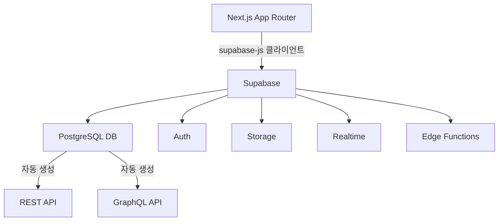

import Alert from '@/components/Alert.astro';

> 이 글은 Supabase 최신 버전(2026년 기준), Next.js 15 App Router 연동을 기준으로 작성되었습니다.

지난 편에서 프론트엔드 스택을 정리했다. 이번에는 백엔드 영역이다. 내부 관리용 SaaS를 바이브 코딩으로 만들 때 백엔드 선택에서 가장 많이 고민하는 지점은 하나다. **"직접 서버를 구축할까, BaaS를 쓸까?"**

결론부터 말하면, 내부 관리 도구 규모에서는 Supabase 같은 BaaS가 압도적으로 유리하다. 이 글에서 다루는 내용:

- BaaS vs 직접 서버 구축의 선택 기준
- Supabase가 제공하는 레이어별 기능과 선택 이유
- AI 에이전트와 함께 DB 스키마 및 RLS 정책 설계하는 방법
- Next.js App Router와 Supabase 연동 패턴

---

## BaaS vs 직접 서버 구축

바이브 코딩에서 백엔드를 직접 구축한다는 건 Spring Boot나 FastAPI로 API 서버를 만들고, 인증 시스템을 설계하고, 배포 파이프라인까지 관리한다는 뜻이다. AI가 도와주더라도 이 모든 결정을 개발자가 내려야 한다.

반면 Supabase 같은 BaaS는 이런 인프라 결정 대부분을 이미 내려놓은 플랫폼이다.

| 비교 항목 | 직접 구축 | Supabase (BaaS) |
|---|---|---|
| 인증 구현 | JWT 설계 + 구현 필요 | 기본 제공 (OAuth, Magic Link 포함) |
| DB | 인스턴스 직접 관리 | Managed PostgreSQL |
| API | 엔드포인트 직접 작성 | 스키마 기반 자동 생성 |
| 스토리지 | S3 연동 직접 구현 | 기본 제공 |
| 실시간 | WebSocket 구현 필요 | Realtime 기본 제공 |
| AI 친화성 | 프레임워크별 상이 | 스키마 중심, AI가 파악하기 쉬움 |

내부 관리 도구 규모(~수십 명 사용자, 일반적인 CRUD 중심)라면 직접 구축의 유연성보다 BaaS의 개발 속도가 훨씬 크게 작용한다.

<Alert type="warning">
다만 사내 보안 정책으로 외부 클라우드 DB를 쓸 수 없는 환경이라면 Supabase의 셀프 호스팅 옵션을 검토하거나, 직접 구축을 선택해야 한다.
</Alert>

---

## Supabase 레이어별 역할

Supabase는 단순한 DB 서비스가 아니다. 백엔드 전체를 커버하는 플랫폼이다.



### PostgreSQL DB

Supabase의 핵심이다. Managed PostgreSQL이라 운영 부담이 없고, 테이블을 만들면 REST API가 자동으로 생성된다. AI 에이전트와 함께 스키마를 설계할 때는 Supabase의 SQL Editor나 마이그레이션 파일을 기준으로 작업하면 된다.

```sql
-- 사용자 프로필 테이블 예시
create table profiles (
  id uuid references auth.users on delete cascade,
  name text not null,
  role text not null default 'user',
  department text,
  created_at timestamptz default now(),
  primary key (id)
);
```

<Alert type="info">
`auth.users`를 직접 건드리지 않고 `profiles` 테이블을 별도로 두는 패턴이 Supabase 공식 권장 방식이다. 인증은 Supabase Auth가 처리하고, 비즈니스 데이터는 profiles에서 관리한다.
</Alert>

### Auth (인증)

이메일/비밀번호, OAuth(Google, GitHub 등), Magic Link를 기본 제공한다. 내부 관리 도구라면 Google OAuth 또는 이메일 방식으로 빠르게 구성할 수 있다.

Next.js App Router에서 Supabase Auth를 연동할 때는 `@supabase/ssr` 패키지를 쓴다.

```typescript
// utils/supabase/server.ts
import { createServerClient } from '@supabase/ssr'
import { cookies } from 'next/headers'

export async function createClient() {
  const cookieStore = await cookies()
  return createServerClient(
    process.env.NEXT_PUBLIC_SUPABASE_URL!,
    process.env.NEXT_PUBLIC_SUPABASE_ANON_KEY!,
    {
      cookies: {
        getAll: () => cookieStore.getAll(),
        setAll: (cookiesToSet) => {
          cookiesToSet.forEach(({ name, value, options }) =>
            cookieStore.set(name, value, options)
          )
        },
      },
    }
  )
}
```

서버 컴포넌트, 서버 액션, API Route별로 클라이언트 생성 방식이 다르다는 점을 주의하자. AI에게 코드 생성을 요청할 때 어떤 컨텍스트인지 명시하는 것이 중요하다.

### RLS (Row Level Security)

Supabase에서 가장 중요하지만 처음에 가장 헷갈리는 개념이다. RLS는 PostgreSQL의 보안 정책으로, 어떤 사용자가 어떤 행(row)을 읽고 쓸 수 있는지 DB 레벨에서 제어한다.

```sql
-- profiles 테이블 RLS 정책 예시
alter table profiles enable row level security;

-- 본인 프로필만 수정 가능
create policy "users can update own profile"
  on profiles for update
  using (auth.uid() = id);

-- admin 역할은 전체 조회 가능
create policy "admins can view all profiles"
  on profiles for select
  using (
    exists (
      select 1 from profiles
      where id = auth.uid() and role = 'admin'
    )
  );
```

RLS를 설정하지 않으면 anon key로 테이블 전체가 조회된다. **반드시 RLS를 활성화한 후 정책을 정의해야 한다.**

AI 에이전트에게 RLS 정책 생성을 요청할 때는 역할(role) 구조를 먼저 설명하는 것이 효과적이다. "admin은 모든 레코드를 볼 수 있고, user는 자신이 속한 department 데이터만 볼 수 있다"처럼 비즈니스 규칙을 자연어로 전달하면 AI가 정책을 잘 작성한다.

### Storage

파일 업로드가 필요하다면 Supabase Storage를 쓴다. S3 호환 API를 제공하고, RLS와 동일한 정책 시스템으로 파일 접근 권한을 제어할 수 있다.

```typescript
// 파일 업로드 예시
const { data, error } = await supabase.storage
  .from('attachments')
  .upload(`${userId}/${fileName}`, file)
```

### Edge Functions

서버에서 실행되어야 하는 커스텀 비즈니스 로직은 Edge Functions(Deno 런타임)으로 처리한다. 예를 들어 외부 API 호출, 이메일 발송, 웹훅 처리 등이 여기 해당한다.

```typescript
// supabase/functions/send-notification/index.ts
Deno.serve(async (req) => {
  const { userId, message } = await req.json()
  // 외부 슬랙 API 호출 등
  return new Response(JSON.stringify({ ok: true }))
})
```

---

## 추가 백엔드 레이어

Supabase만으로 대부분의 내부 관리 도구를 커버할 수 있지만, 필요에 따라 아래 레이어를 추가한다.

| 역할 | 추천 기술 | 이유 |
|---|---|---|
| 스케줄 작업 | Supabase pg_cron | DB 내부에서 크론 실행, 별도 인프라 불필요 |
| 복잡한 서버 로직 | Next.js Server Actions | 별도 API 서버 없이 서버 코드 실행 |
| 배치 처리 | Trigger.dev | AI 레퍼런스 많고 TypeScript 지원 |
| 이메일 발송 | Resend | supabase-js와 조합하기 쉬움 |
| 검색 | PostgreSQL Full-text Search | Supabase 내에서 바로 사용 가능 |

---

## Next.js App Router 연동 패턴

실제 코드에서 서버 컴포넌트, 클라이언트 컴포넌트, 서버 액션별로 Supabase를 어떻게 쓰는지 정리했다.

**서버 컴포넌트에서 데이터 조회**

```typescript
// app/users/page.tsx (서버 컴포넌트)
import { createClient } from '@/utils/supabase/server'

export default async function UsersPage() {
  const supabase = await createClient()
  const { data: users } = await supabase
    .from('profiles')
    .select('*')
    .order('created_at', { ascending: false })

  return <UserTable users={users ?? []} />
}
```

**서버 액션에서 데이터 변경**

```typescript
// app/users/actions.ts
'use server'
import { createClient } from '@/utils/supabase/server'
import { revalidatePath } from 'next/cache'

export async function updateUserRole(userId: string, role: string) {
  const supabase = await createClient()
  const { error } = await supabase
    .from('profiles')
    .update({ role })
    .eq('id', userId)

  if (error) throw new Error(error.message)
  revalidatePath('/users')
}
```

**클라이언트 컴포넌트에서 Realtime 구독**

```typescript
// components/notifications-badge.tsx
'use client'
import { createClient } from '@/utils/supabase/client'
import { useEffect, useState } from 'react'

export function NotificationsBadge() {
  const [count, setCount] = useState(0)
  const supabase = createClient()

  useEffect(() => {
    const channel = supabase
      .channel('notifications')
      .on('postgres_changes', {
        event: 'INSERT',
        schema: 'public',
        table: 'notifications',
      }, () => setCount(c => c + 1))
      .subscribe()

    return () => { supabase.removeChannel(channel) }
  }, [])

  return <span>{count}</span>
}
```

---

## AI 에이전트와 함께 DB 설계하기

Supabase는 스키마 중심 플랫폼이라 AI와 협업하기 좋다. `CLAUDE.md`에 다음 내용을 추가해두자.

```markdown
## 백엔드 스택
- BaaS: Supabase (PostgreSQL + Auth + Storage)
- 연동 패키지: @supabase/ssr (서버), @supabase/supabase-js (클라이언트)
- 인증 방식: Google OAuth + 이메일/비밀번호

## DB 설계 규칙
- 모든 테이블에 RLS 활성화 필수
- 사용자 정보는 profiles 테이블 (auth.users 참조)
- created_at, updated_at 컬럼 모든 테이블에 포함
- UUID는 gen_random_uuid() 사용

## 역할 구조
- admin: 전체 데이터 조회/수정 가능
- manager: 소속 팀 데이터 조회/수정 가능
- user: 본인 데이터만 조회/수정 가능
```

이 정보가 있으면 AI가 "신규 주문 테이블 만들어줘"라는 요청에 RLS 정책, 인덱스, 타입스크립트 타입까지 포함한 완성형 코드를 생성한다.

---

## 마치며

바이브 코딩 맥락에서 내부 관리 SaaS 백엔드의 핵심은 **빠른 초기 구축 + AI가 파악하기 쉬운 구조**다. Supabase는 스키마 → API → 인증 → 보안 정책이 하나의 플랫폼 안에서 연결되어 있어 AI와 함께 설계하기에 특히 유리하다.

프론트엔드 편(1편)과 이번 백엔드 편에서 정리한 스택을 조합하면 아래와 같은 풀스택 구성이 완성된다.

| 레이어 | 기술 |
|---|---|
| 프레임워크 | Next.js 15 (App Router) |
| 언어 | TypeScript 5 (strict) |
| UI | shadcn/ui + Tailwind CSS v4 |
| 상태 관리 | TanStack Query + Zustand |
| 백엔드/BaaS | Supabase |
| DB | PostgreSQL (via Supabase) |
| 인증 | Supabase Auth |
| 배포 | Vercel + Supabase Cloud |

이 스택은 1인 개발자부터 소규모 팀까지, 바이브 코딩으로 내부 관리 도구를 빠르게 만들고 싶을 때 현재 시점에서 가장 균형 잡힌 선택이라고 생각한다.
