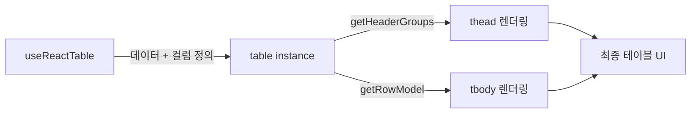

import Alert from '@/components/Alert.astro';

> 이 글은 Next.js 15, React 19, TypeScript 5 기준으로 작성되었습니다.

바이브 코딩(Vibe Coding)으로 SaaS를 만들 때 가장 먼저 맞닥뜨리는 고민이 있다. "어떤 기술 스택을 선택해야 AI가 가장 잘 도와줄까?" 불특정 다수 대상의 B2C 서비스가 아니라 ERP처럼 사내 구성원이 사용하는 **내부 관리용 서비스**라면 선택 기준이 조금 달라진다.

이 글에서 다루는 내용:
- 바이브 코딩 맥락에서 프론트엔드 스택을 고를 때의 핵심 기준
- 레이어별 추천 기술과 선택 이유
- AI 에이전트가 코드를 잘 생성하도록 환경을 세팅하는 방법

---

## 기술 스택 선택 기준

바이브 코딩은 AI가 코드를 상당 부분 생성하는 개발 방식이다. 그래서 스택 선택 기준이 일반 개발과 조금 다르다.

**① AI 학습 데이터가 충분한 기술인가?**

AI 에이전트는 GitHub, 공식 문서, Stack Overflow 등에서 학습한다. 레퍼런스가 많은 기술일수록 더 정확한 코드를 생성한다. React, Next.js, TypeScript는 이 조건을 가장 잘 충족하는 기술이다.

**② 타입 정보가 풍부한가?**

TypeScript의 strict 모드를 켜두면 AI가 함수 시그니처와 데이터 구조를 보고 훨씬 정확한 코드를 제안한다. 타입이 없는 JavaScript보다 AI 코드 생성 품질이 체감상 크게 올라간다.

**③ 컴포넌트가 내 코드베이스 안에 있는가?**

shadcn/ui가 주목받는 이유가 여기 있다. 외부 패키지를 그냥 import하는 게 아니라, 컴포넌트 코드를 프로젝트 안으로 복사해서 가져오는 방식이다. AI가 해당 컴포넌트를 직접 수정하고 커스터마이징할 수 있어 바이브 코딩과 잘 맞는다.

---

## 레이어별 추천 스택

### 프레임워크: Next.js 15 (App Router) + React 19

내부 관리 도구라도 Next.js를 선택하는 이유는 **구조적 명확성** 때문이다. App Router는 서버 컴포넌트와 클라이언트 컴포넌트의 역할을 파일 구조와 `"use client"` 지시어로 명시한다. AI 에이전트가 코드를 생성할 때 어떤 컴포넌트가 서버에서 실행되고 어떤 게 브라우저에서 실행되는지 판단하기 쉬워진다.

```
app/
├── (dashboard)/
│   ├── layout.tsx      # 서버 컴포넌트
│   └── page.tsx        # 서버 컴포넌트
└── components/
    └── data-table.tsx  # "use client" 클라이언트 컴포넌트
```

<Alert type="info">
내부 관리 도구는 Vite + React SPA로 구성해도 충분하지만, Next.js를 쓰면 나중에 API Route나 SSR이 필요할 때 프레임워크를 갈아엎지 않아도 된다.
</Alert>

### 언어: TypeScript 5 (strict mode)

`tsconfig.json`에 `"strict": true`를 설정하는 것만으로 AI 코드 생성 품질이 눈에 띄게 달라진다.

```json
{
  "compilerOptions": {
    "strict": true,
    "noUncheckedIndexedAccess": true,  // 배열/객체 접근 시 undefined 체크 강제
    "exactOptionalPropertyTypes": true
  }
}
```

처음에는 타입 오류가 많아 번거롭게 느껴지지만, ERP처럼 장기간 운영하는 시스템에서는 타입이 곧 문서이자 AI의 컨텍스트다.

### UI 컴포넌트: shadcn/ui + Radix UI

shadcn/ui는 `npx shadcn@latest add button`처럼 CLI로 컴포넌트를 추가하면 소스 코드가 `components/ui/` 폴더에 복사된다. 이 방식의 장점은 두 가지다.

- **완전한 제어권**: 디자인 토큰이나 동작을 직접 수정할 수 있다
- **AI 친화성**: AI가 `components/ui/button.tsx`를 직접 열어서 고칠 수 있다

Radix UI는 shadcn/ui의 기반 라이브러리로, Dialog, DropdownMenu, Tooltip 등 접근성(a11y)이 기본 탑재된 헤드리스 컴포넌트를 제공한다. 폼이 많은 관리 화면에서 키보드 네비게이션과 스크린 리더 지원이 자동으로 해결된다.

### 스타일링: Tailwind CSS v4

Tailwind v4는 CSS-first 설정 방식으로 바뀌었다. `tailwind.config.js` 대신 CSS 파일에서 직접 디자인 토큰을 정의한다.

바이브 코딩에서 한 가지 강하게 추천하는 패턴이 있다. 디자인 토큰을 `globals.css`에 인라인으로 쓰지 말고 **`design-tokens.css`로 분리**하는 것이다.

```
styles/
├── design-tokens.css   ← 색상, 타이포, 간격 등 토큰 전담
└── globals.css         ← @import + 전역 리셋만
```

```css
/* styles/design-tokens.css */
@theme {
  /* 색상 */
  --color-primary: #6366f1;
  --color-primary-foreground: #ffffff;
  --color-secondary: #f1f5f9;
  --color-destructive: #ef4444;

  /* 타이포그래피 */
  --font-sans: "Pretendard", sans-serif;
  --text-heading: 1.5rem;
  --text-body: 0.875rem;

  /* 간격 / 반경 */
  --radius-card: 0.75rem;
  --radius-button: 0.5rem;
  --spacing-page: 1.5rem;
}
```

```css
/* styles/globals.css */
@import "tailwindcss";
@import "./design-tokens.css";
```

이렇게 분리하는 이유는 하나다. **AI 에이전트가 토큰 파일만 열면 프로젝트 전체의 디자인 언어를 즉시 파악할 수 있기 때문이다.** `globals.css`가 수백 줄짜리 혼합 파일이 되면 AI가 어떤 값을 써야 할지 매번 추론해야 하고, 그 과정에서 하드코딩된 색상이나 일관성 없는 간격이 생긴다.

`CLAUDE.md`에 한 줄만 추가해두면 충분하다.

```markdown
## 디자인 시스템
- 디자인 토큰: styles/design-tokens.css 참조
- 컴포넌트 생성 시 하드코딩 금지, 반드시 토큰 변수 사용
```

<Alert type="info">
shadcn/ui를 쓴다면 `components.json`의 `cssVariables: true` 설정과 함께 쓰자. shadcn 컴포넌트가 참조하는 `--primary`, `--radius` 같은 변수도 `design-tokens.css`에서 일괄 관리할 수 있다.
</Alert>

### 서버 상태: TanStack Query v5

관리 도구는 대부분 서버 데이터를 가져와서 보여주는 작업의 연속이다. TanStack Query는 API 캐싱, 백그라운드 갱신, 로딩/에러 상태 처리를 선언적으로 다룬다.

```typescript
// 사용자 목록 조회 예시
const { data: users, isLoading } = useQuery({
  queryKey: ['users', { page, search }],
  queryFn: () => fetchUsers({ page, search }),
  staleTime: 1000 * 60, // 1분간 캐시 유지
});
```

서버 상태(API 데이터)와 클라이언트 상태(UI 상태)를 분리하는 게 핵심이다. 이 둘을 하나의 전역 스토어에 섞으면 관리가 복잡해진다.

### 클라이언트 상태: Zustand

사이드바 열림/닫힘, 선택된 탭, 모달 상태처럼 서버와 무관한 UI 상태는 Zustand로 관리한다. Redux보다 설정이 간단하고 AI가 보일러플레이트 없이 바로 쓸 수 있는 코드를 생성한다.

```typescript
interface SidebarStore {
  isOpen: boolean;
  toggle: () => void;
}

const useSidebarStore = create<SidebarStore>((set) => ({
  isOpen: true,
  toggle: () => set((state) => ({ isOpen: !state.isOpen })),
}));
```

### 폼 / 유효성 검증: React Hook Form + Zod

내부 관리 도구의 핵심은 폼이다. 등록, 수정, 검색 필터까지 폼이 없는 화면이 없다. React Hook Form은 불필요한 리렌더링 없이 폼 상태를 관리하고, Zod는 TypeScript 타입과 런타임 유효성 검증을 동시에 처리한다.

```typescript
const userSchema = z.object({
  name: z.string().min(2, '이름은 2자 이상이어야 합니다'),
  email: z.string().email('올바른 이메일 형식이 아닙니다'),
  role: z.enum(['admin', 'user', 'viewer']),
});

type UserForm = z.infer<typeof userSchema>; // 타입 자동 추론
```

AI에게 "이 스키마 기준으로 폼 컴포넌트 만들어줘"라고 하면 유효성 검증까지 포함된 완성형 코드를 바로 받을 수 있다.

### 데이터 테이블: TanStack Table v8

관리 도구의 꽃은 테이블이다. 정렬, 필터, 페이지네이션, 행 선택, 컬럼 숨기기까지. TanStack Table은 UI를 직접 그리지 않고 테이블 로직만 제공하는 헤드리스 방식이라, shadcn/ui의 Table 컴포넌트와 조합해서 완전히 커스텀할 수 있다.



### 차트: Recharts

Recharts는 React 친화적인 차트 라이브러리로 AI 레퍼런스가 풍부하다. 대시보드에 KPI 차트가 필요하다면 Tremor를 추가로 고려해볼 수 있다. Tremor는 Recharts 기반으로 어드민 대시보드에 특화된 고수준 컴포넌트를 제공한다.

### DX / 품질: Vite + Vitest + Storybook

| 도구 | 역할 | AI 친화성 |
|---|---|---|
| Vite | 번들러 / 개발 서버 | 설정 최소화, AI가 건드릴 일 거의 없음 |
| Vitest | 단위 테스트 | Jest 호환 API, 레퍼런스 많음 |
| Storybook | 컴포넌트 카탈로그 | CLAUDE.md에 경로 명시하면 AI가 스토리 자동 생성 |
| ESLint + Prettier | 코드 품질 | AI 생성 코드도 자동 포맷 |
| Husky | Git 훅 | 커밋 전 lint 자동 실행 |

<Alert type="info">
Storybook을 운영하면 AI가 기존 컴포넌트 목록을 파악하고 중복 생성을 줄일 수 있다.
</Alert>

### 배포 / 인프라: Vercel 또는 AWS

내부 관리 도구라면 배포 환경 선택이 달라진다.

| 상황 | 추천 |
|---|---|
| 빠른 프로토타입, 팀 소규모 | Vercel |
| 사내 보안 정책, AWS 기존 인프라 있음 | S3 + CloudFront + ECS |
| 온프레미스 필요 | Docker + 자체 서버 |

---

## AI 에이전트를 위한 환경 세팅

스택을 정했다면 `CLAUDE.md`에 아래 내용을 명시해두자. AI가 매번 스택을 추론하지 않고 일관된 코드를 생성한다.

```markdown
## 기술 스택
- Framework: Next.js 15 (App Router)
- Language: TypeScript 5 (strict)
- UI: shadcn/ui + Radix UI
- Styling: Tailwind CSS v4 (디자인 토큰: styles/design-tokens.css 참조, 하드코딩 금지)
- 서버 상태: TanStack Query v5
- 클라이언트 상태: Zustand
- 폼: React Hook Form + Zod
- 테이블: TanStack Table v8

## 컴포넌트 생성 규칙
- UI 컴포넌트는 components/ui/ 에 위치
- 페이지별 컴포넌트는 components/{도메인}/ 에 위치
- 서버 컴포넌트가 기본, 클라이언트 상태 필요 시에만 "use client" 추가
```

---

## 마치며

바이브 코딩에서 스택 선택의 핵심은 **AI가 잘 아는 기술 + 내 코드베이스 안에 있는 코드** 조합이다. 화려한 최신 기술보다 레퍼런스가 풍부하고 타입이 명확한 기술이 실제로 AI와 함께 개발할 때 훨씬 편하다.

다음 편에서는 백엔드 영역, 특히 Supabase를 중심으로 한 BaaS 스택을 다룬다. 인증, DB 스키마, RLS 정책까지 AI와 함께 설계하는 방법을 정리할 예정이다.
