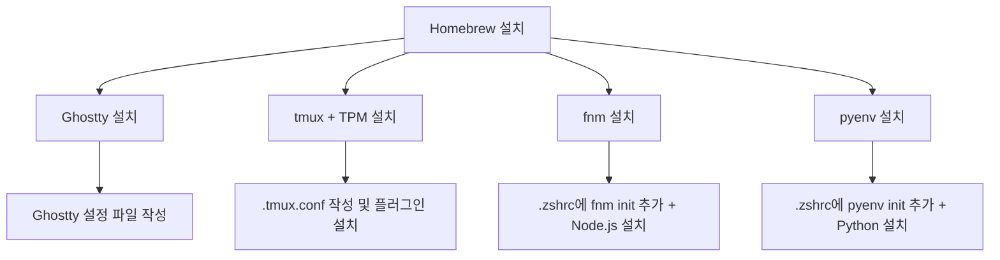

import Alert from '@/components/Alert.astro';

> macOS Tahoe, 새 Mac — 처음 할 일은 개발 도구 세팅이다. 이 글 하나로 끝낸다.

## 이 글에서 다루는 내용

- Homebrew 설치 및 기본 사용법
- Ghostty로 터미널 환경 교체하기
- tmux 설치와 플러그인(TPM) 세팅
- fnm으로 Node.js 버전 관리하기
- pyenv로 Python 버전 관리하기

---

## Homebrew — 모든 것의 시작

macOS에는 공식 패키지 매니저가 없다. 그 공백을 채워주는 게 [Homebrew](https://brew.sh)다. 개발 도구든 GUI 앱이든 `brew` 명령 하나로 설치·업데이트·삭제가 가능하고, 이후 소개할 도구들도 모두 Homebrew를 통해 설치한다.

터미널을 열고 아래 명령을 붙여넣는다.

```bash
/bin/bash -c "$(curl -fsSL https://raw.githubusercontent.com/Homebrew/install/HEAD/install.sh)"
```

설치가 끝나면 셸에 PATH를 추가해야 한다. Apple Silicon Mac이라면 Homebrew가 `/opt/homebrew`에 설치되는데, 기본 PATH에는 이 경로가 없다.

```bash
# ~/.zshrc 또는 ~/.zprofile에 추가
echo 'eval "$(/opt/homebrew/bin/brew shellenv)"' >> ~/.zprofile
source ~/.zprofile
```

Intel Mac이라면 경로가 `/usr/local`이므로 별도 추가 없이 바로 사용 가능하다.

```bash
# 정상 설치 확인
brew --version
```
<Alert type="tip" title="brew doctor">
설치 직후 `brew doctor`를 실행해보자. 환경 문제를 미리 진단해줘서 나중에 생길 수 있는 이상한 오류를 예방할 수 있다.
</Alert>

---

## Ghostty — 터미널을 갈아치울 시간

기본 Terminal.app도 나쁘지 않지만, [Ghostty](https://ghostty.org)를 써본 뒤로는 돌아가기 어렵다. GPU 렌더링 기반이라 스크롤과 출력이 눈에 띄게 빠르고, 설정 파일 하나로 모든 옵션을 관리할 수 있다. macOS 네이티브 앱이라 Tahoe의 새로운 UI 스타일과도 잘 맞는다.

```bash
brew install --cask ghostty
```

설치 후 처음 실행하면 설정 파일 위치를 묻는 경우가 있다. Ghostty의 설정 파일은 `~/.config/ghostty/config`다.

```bash
mkdir -p ~/.config/ghostty
touch ~/.config/ghostty/config
```

기본 설정 예시다. 취향에 맞게 수정하면 된다.

```ini
# ~/.config/ghostty/config

font-family = "JetBrains Mono"
font-size = 14

theme = "catppuccin-mocha"

# 창 여백 (읽기 편한 여백)
window-padding-x = 12
window-padding-y = 10

# 탭 바 숨김 (tmux를 쓴다면 불필요)
macos-titlebar-style = hidden
```

<Alert type="info" title="Ghostty 테마">
Ghostty는 테마를 내장하고 있어서 별도 테마 파일 다운로드 없이 `theme = "테마명"` 한 줄로 바꿀 수 있다. `ghostty +list-themes`로 전체 목록 확인 가능.
</Alert>


---

## tmux — 터미널 세션을 영구적으로

터미널 창을 닫아도 작업이 사라지지 않길 바란다면 tmux가 답이다. 세션·윈도우·패널을 자유롭게 나눠 쓸 수 있고, 플러그인 생태계도 탄탄하다.

### 설치

```bash
brew install tmux
```

### TPM — 플러그인 매니저 설치

tmux 플러그인은 수동으로 관리하기 번거롭다. TPM(Tmux Plugin Manager)을 먼저 설치하자.

```bash
git clone https://github.com/tmux-plugins/tpm ~/.tmux/plugins/tpm
```

### .tmux.conf 설정

`~/.tmux.conf` 파일을 만들고 아래 내용을 붙여넣는다.

```bash
# ~/.tmux.conf

# prefix 키 변경 (Ctrl+b → Ctrl+a)
unbind C-b
set-option -g prefix C-a
bind-key C-a send-prefix

# 마우스 지원 활성화
set -g mouse on

# 창 번호 1부터 시작
set -g base-index 1
setw -g pane-base-index 1

# 색상 설정
set -g default-terminal "tmux-256color"
set -ag terminal-overrides ",xterm-256color:RGB"

# 플러그인 목록
set -g @plugin 'tmux-plugins/tpm'
set -g @plugin 'tmux-plugins/tmux-sensible'
set -g @plugin 'tmux-plugins/tmux-resurrect'   # 세션 저장/복원
set -g @plugin 'tmux-plugins/tmux-continuum'   # 자동 저장

# tmux-continuum 설정
set -g @continuum-restore 'on'   # tmux 시작 시 세션 자동 복원
set -g @continuum-save-interval '15'  # 15분마다 자동 저장

# TPM 초기화 (항상 마지막 줄에)
run '~/.tmux/plugins/tpm/tpm'
```

설정을 적용하고 플러그인을 설치한다.

```bash
# 설정 적용
tmux source ~/.tmux.conf

# tmux 실행 후 플러그인 설치
tmux new -s main
# tmux 안에서: prefix + I (대문자 I)
```

<Alert type="tip" title="tmux-resurrect 단축키">
- **저장**: `prefix + Ctrl+s`
- **복원**: `prefix + Ctrl+r`

tmux-continuum이 자동 저장을 담당하지만, 중요한 작업 전에는 수동으로 저장해두는 습관을 들이자.
</Alert>

---

## fnm — Node.js 버전 관리

Node.js를 직접 설치하면 버전 전환이 번거롭고, 프로젝트마다 요구하는 버전이 달라 충돌이 생기기 쉽다. [fnm(Fast Node Manager)](https://github.com/Schniz/fnm)은 이름처럼 빠르고, `.node-version` 파일을 자동으로 읽어 버전을 전환해준다.

### 설치

```bash
brew install fnm
```

설치 후 셸 설정 파일에 초기화 코드를 추가한다.

```bash
# ~/.zshrc에 추가
eval "$(fnm env --use-on-cd --shell zsh)"
```

터미널을 재시작하거나 `source ~/.zshrc`를 실행한 뒤 Node.js를 설치한다.

```bash
# LTS 버전 설치 및 기본값 설정
fnm install --lts
fnm default lts-latest

# 특정 버전 설치
fnm install 20
fnm install 22

# 버전 전환
fnm use 20

# 설치된 버전 목록
fnm list
```

프로젝트 루트에 `.node-version` 파일을 두면 해당 디렉토리에 진입할 때 자동으로 버전이 전환된다.

```bash
# 현재 디렉토리에 .node-version 파일 생성
echo "20" > .node-version
```

---

## pyenv — Python 버전 관리

macOS에는 시스템 Python이 내장되어 있지만, 이 Python을 직접 건드리는 건 좋지 않다. [pyenv](https://github.com/pyenv/pyenv)를 통해 Python 버전을 프로젝트별로 격리해 관리하자.

### 설치

```bash
brew install pyenv
```

셸 설정 파일에 초기화 코드를 추가한다.

```bash
# ~/.zshrc에 추가
export PYENV_ROOT="$HOME/.pyenv"
export PATH="$PYENV_ROOT/bin:$PATH"
eval "$(pyenv init -)"
```

`source ~/.zshrc` 후 Python을 설치한다.

```bash
# 설치 가능한 버전 목록 확인
pyenv install --list | grep "  3\."

# 최신 안정 버전 설치 (예: 3.13.x)
pyenv install 3.13.3

# 전역 기본값 설정
pyenv global 3.13.3

# 특정 프로젝트에서만 버전 지정
cd my-project
pyenv local 3.11.9   # .python-version 파일 생성
```

<Alert type="warning" title="pyenv 주의사항">
pyenv로 설치한 Python과 pip는 시스템 Python과 완전히 분리된다. `python` 명령이 pyenv 버전을 가리키는지 `which python`으로 확인하자. `/Users/username/.pyenv/shims/python`이 나와야 정상이다.
</Alert>

---

## 전체 설치 순서 요약

처음부터 따라 하는 경우라면 아래 순서를 참고하자.



셸 설정 파일(`~/.zshrc`)에 추가되는 내용을 한 곳에 모아두면 나중에 관리하기 편하다.

```bash
# ~/.zshrc — 개발 도구 초기화 모음

# Homebrew (Apple Silicon)
eval "$(/opt/homebrew/bin/brew shellenv)"

# fnm
eval "$(fnm env --use-on-cd --shell zsh)"

# pyenv
export PYENV_ROOT="$HOME/.pyenv"
export PATH="$PYENV_ROOT/bin:$PATH"
eval "$(pyenv init -)"
```

---

## 마치며

Homebrew 하나만 제대로 잡아두면 나머지는 생각보다 빠르게 끝난다. 각 도구를 설치한 뒤에는 꼭 새 터미널을 열거나 `source ~/.zshrc`로 설정을 적용하는 걸 잊지 말자. 설치는 됐는데 명령어가 안 먹힌다면 열에 아홉은 PATH 문제다.

다음에는 이 환경 위에서 Zsh 플러그인(zsh-autosuggestions, zsh-syntax-highlighting)과 Starship 프롬프트를 얹는 방법도 다뤄볼 예정이다.
